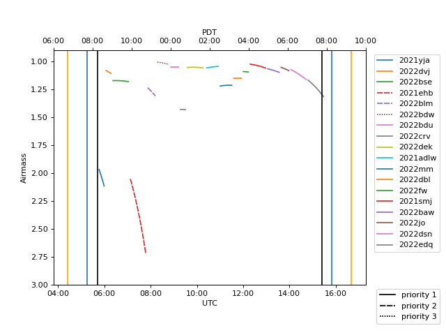

# YSE_Scheduler

Simple observation scheduler for YSE-PZ.

To reproduce the needed environment run: `conda env create -f sched.yml; conda activate sched`

Requires a column after mag = ? that sets priority (check example file ShanePriority_2022-03-06.txt).

Usage example: `python make_schedule.py ShanePriorities_2022-03-06.txt`

Check `python make_schedule.py -h` for options.
